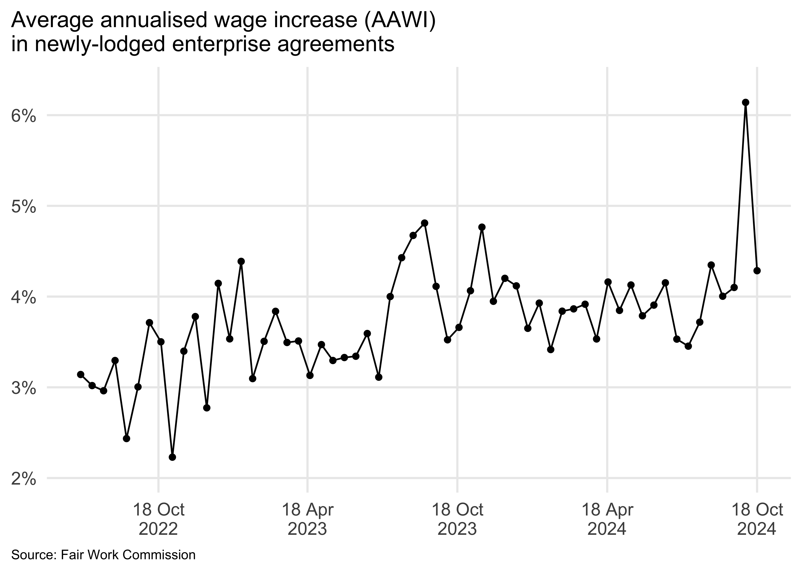
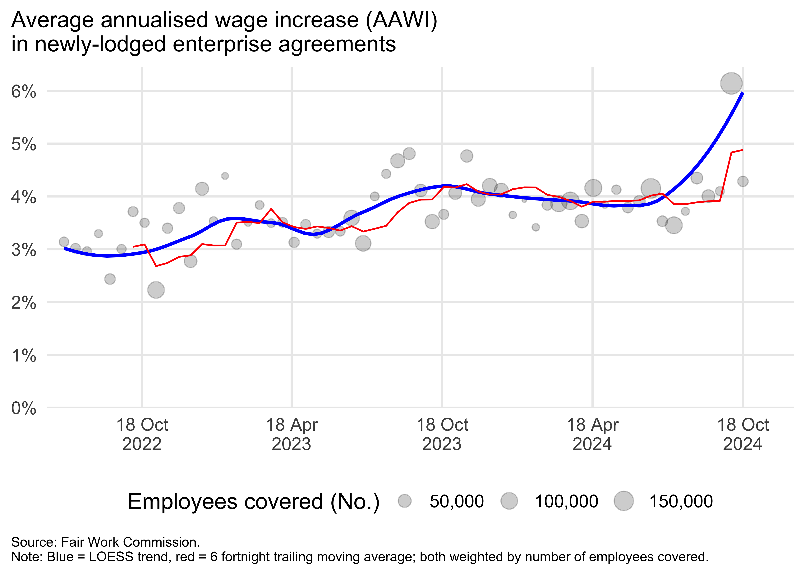

<!-- README.md is generated from README.Rmd. Please edit that file -->

# readeba

<!-- badges: start -->

[](https://github.com/MattCowgill/readeba/actions/workflows/R-CMD-check.yaml)
[](https://lifecycle.r-lib.org/articles/stages.html#experimental)
<!-- badges: end -->

The goal of `{readeba}` is to download and import data on enterprise
agreement settlements in Australia.

## Installation

You can install the development version of readeba from
[GitHub](https://github.com/) with:

``` r
# install.packages("devtools")
devtools::install_github("MattCowgill/readeba")
```

## Example

This is a basic example which shows you how to solve a common problem:

``` r
library(readeba)
library(tidyverse)
#> ── Attaching core tidyverse packages ─────────────────── tidyverse 1.3.2.9000 ──
#> ✔ dplyr     1.1.0          ✔ readr     2.1.4     
#> ✔ forcats   1.0.0          ✔ stringr   1.5.0     
#> ✔ ggplot2   3.4.0.9000     ✔ tibble    3.1.8     
#> ✔ lubridate 1.9.1          ✔ tidyr     1.3.0     
#> ✔ purrr     1.0.1          
#> ── Conflicts ────────────────────────────────────────── tidyverse_conflicts() ──
#> ✖ dplyr::filter() masks stats::filter()
#> ✖ dplyr::lag()    masks stats::lag()
#> ℹ Use the ]8;;http://conflicted.r-lib.org/conflicted package]8;; to force all conflicts to become errors

fwc <- read_fwc()

fwc 
#> # A tibble: 390 × 4
#>    date       indicator               union  value
#>    <date>     <chr>                   <chr>  <dbl>
#>  1 2022-07-15 Employees covered (No.) Total  19132
#>  2 2022-07-29 Employees covered (No.) Total  20038
#>  3 2022-08-12 Employees covered (No.) Total  15331
#>  4 2022-08-26 Employees covered (No.) Total  10065
#>  5 2022-09-09 Employees covered (No.) Total  26449
#>  6 2022-09-23 Employees covered (No.) Total  16526
#>  7 2022-10-07 Employees covered (No.) Total  21218
#>  8 2022-10-21 Employees covered (No.) Total  16294
#>  9 2022-11-04 Employees covered (No.) Total 100074
#> 10 2022-11-18 Employees covered (No.) Total  24113
#> # … with 380 more rows
```

Visualise it!

``` r
fwc |> 
  filter(union == "Total",
         indicator == "AAWI (%)") |> 
  ggplot(aes(x = date, y = value)) +
  geom_line() +
  theme_minimal()
```



``` r
fwc |> 
  filter(union == "Total") |> 
  pivot_wider(names_from = indicator) |> 
  ggplot(aes(x = date, 
             y = `AAWI (%)`,
             weight = `Employees covered (No.)` )) +
  geom_point(aes(size = `Employees covered (No.)`)) +
  geom_smooth(method = "loess",
              formula = y ~ x,
              se = FALSE) +
  scale_y_continuous(limits = \(x) c(0, x[2])) +
  scale_x_date(breaks = \(x) seq(x[2], x[1], by = "-6 months"))
```


